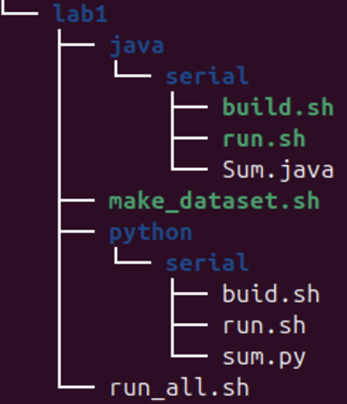

# Lab1 - Warmup - 24.1

## Objetivo

Neste laboratório, vocês precisarão melhorar o desempenho da implementação (python e java) fornecida do cálculo de **sums** de arquivos usando paralelismo. O **sum** de um arquivo é uma representação numérica de seu conteúdo. Há várias maneiras de calcular o sum. Nesse laboratório, implementamos uma versão simples que retorna a soma dos valores de cada byte do conteúdo do arquivo. O código atual realiza o cálculo sequencialmente para cada arquivo passado como parâmetro pelo usuário. O objetivo é usar múltiplas threads para processar os arquivos de forma concorrente e diminuir o tempo total de processamento.

## Visão geral do código base

- Código base [neste repositório](https://github.com/thiagomanel/fpc/tree/master/2024.1/lab1)

O código está organizado na seguinte hierarquia:



Temos dois diretórios (**lab1/java** e **lab1/python**) que mantêm as implementações em cada uma das linguagens. Para cada linguagem temos um diretório com a implementação **sem concorrência (serial)**.

Durante o desenvolvimento do laboratório, você deve criar novos diretórios para o código concorrente. Ou seja, você deverá ter **lab1/java/concurrent** e **lab1/python/concurrent**.

As implementações básicas (serial) são acompanhadas de dois scripts bash: 1) **build.sh**; 2) **run.sh**. O primeiro script compila o código correspondente enquanto o segundo o executa. Você deve manter essa estrutura na versão concorrente do seu código.

Para facilitar o teste do seu código use o script **make_dataset.sh**. Este script recebe um argumento que indica a quantidade de arquivos a ser criada em um diretório padrão. Ou seja, se executado assim:

```
bash make_dataset.sh 10000
```

O script criará 10000 arquivos com conteúdo aleatório no diretório **dataset/** (que também será criado pelo script).

Ainda, você pode usar o script **run_all.sh** que executará as implementações desenvolvidas para processar o dataset gerado pelo script anterior (e, indicará o tempo de execução de cada uma das versões). O código base chama os script python e java seriais. você pode alterar o script para executar o código concorrente ao fim de sua implementação.

