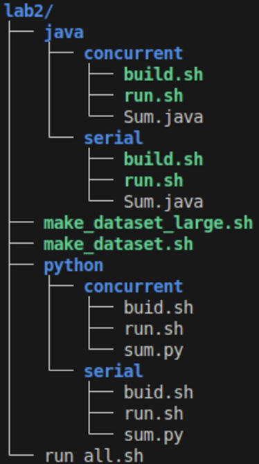

# Lab2 - Having children - 24.1

## Objetivo

O objetivo do [laboratório anterior](https://github.com/paolamoura/concurrent-programming/tree/main/lab1) foi entender os ciclos de criação e finalização de threads para **java** e **python**. Agora, neste laboratório, temos como objetivo estudar aspectos básicos de **sincronização** entre threads. 

Precisaremos sincronizar threads para implementar três requisitos: 
1. retornar o valor da soma de todos os arquivos;
2. reduzir o consumo de memória processando no máximo N/2 arquivos concorrentemente (onde n é a quantidade de arquivos passados como parâmetro); 
3. encontrar arquivos que tenham somas iguais.

Para isso, você poderá/precisará implementar **exclusão mútua**, uso de um **multiplex** (para controlar um número máximo de threads concorrentes) e esperar que a soma de todos os arquivos tenha sido calculada para, em seguida, encontrar arquivos de mesma soma.

- ```Comportamento esperado - Etapa 1```

Para a primeira etapa, o programa deverá escrever na saída padrão somente um valor: o valor total com a soma de todos os arquivos. Internamente, crie uma variável global para armazenar esta soma.

- ```Comportamento esperado - Etapa 2```

Na etapa dois, mantenham um número máximo de N/2 threads calculando o **sum** de cada arquivo (com N sendo o número de arquivos passados para o programa). É importante atentar para o fato que você deve seguir o estilo básico de programação do laboratório anterior e portanto você **deve criar N threads (uma para cada arquivo)**. O controle de admissão (com multiplex) deve envolver somente a execução do **sum**. O código da etapa 2 deve incluir o comportamento da etapa 1, ou seja, o programa deve continuar escrevendo na saída padrão a soma total de todos os arquivos.

- ```Comportamento esperado - Etapa 3```

Na última etapa, será necessário escrever na saída padrão os arquivos que tem o mesmo valor de **sum**. Para testar seu código, basta criar alguns arquivos de mesmo conteúdo (por exemplo, criando uma cópia, de nome diferente, de um arquivo já criado). Essa etapa deve manter o comportamento das etapas anteriores. Adicionalmente, na saída padrão deve-se indicar os arquivos de mesmo **sum** da seguinte forma:

```
35 filenameM filenameX filenameY
```

No caso, o primeiro token indica o valor de sum 35 e os demais tokens indicam os nomes dos arquivos que tem sum igual à 35.

Você só deve escrever na saída padrão para os casos de arquivos com mesmo sum. Ou seja, se um arquivo for único (não tiver outro arquivo com o mesmo sum) ele não deve ser impresso.

## Visão geral do código base

- Código base [neste repositório](https://github.com/thiagomanel/fpc/tree/master/2024.1/lab2)

O código está organizado na seguinte hierarquia:




Temos dois diretórios (**lab2/java** e **lab2/python**) que mantêm as implementações em cada uma das linguagens. Para cada linguagem temos os diretórios com a implementação sem concorrência (serial) e com concorrência (**concurrent**). 

As implementações básicas (**serial e concurrent**) são acompanhadas de dois scripts bash: ```1) build.sh```; ```2) run.sh```. O primeiro script compila o código correspondente enquanto o segundo o executa. Você deve manter essa estrutura na versão concorrente do seu código.

Para facilitar o teste do seu código use o script ```make_dataset.sh```. Este script recebe um argumento que indica a quantidade de arquivos a ser criada em um diretório padrão. Ou seja, se executado assim:

	bash make_dataset.sh 10000

Para facilitar a visualização de concorrência use o script ```make_dataset_large.sh```. Este script recebe um argumento que indica a quantidade de arquivos grandes (cerca de 100 vezes maiores que o anterior) a ser criada em um diretório padrão. Ou seja, se executado assim:

	bash make_dataset_large.sh 10000


O script criará 10000 arquivos com conteúdo aleatório no diretório ```dataset/``` (que também será criado pelo script).

Ainda, você pode usar o script ```run_all.sh``` que executará as implementações desenvolvidas para processar o dataset gerado pelo script anterior (e, indicará o tempo de execução de cada uma das versões). O código base chama os **script python e java seriais**. você pode alterar o script para executar o código concorrente ao fim de sua implementação.

