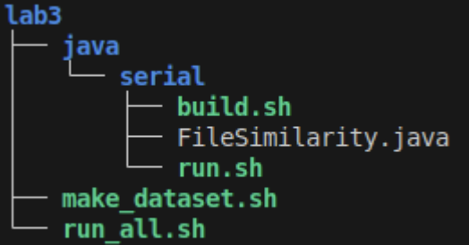

# Lab3 - Growing Up - 24.1

## Objetivo 

O objetivo do [laboratório anterior](https://github.com/paolamoura/concurrent-programming/tree/main/lab2) foi entender aspectos básicos de sincronização entre threads em **java** ou **python**. Agora, neste laboratório, temos como objetivo **melhorar o desempenho** de um programa através de concorrência, mantendo o programa correto (e, para isso, protegendo algumas regiões críticas e coordenando a execução das threads) como **proteger** regiões críticas mais complexas para **funcionamento correto** entre threads. 

Nesse novo laboratório, usaremos o código base anterior. Agora, precisamos computar **a similaridade entre arquivos**. 

Um arquivo pode apresentar algum grau de similaridade (um valor entre 0 e 1) com outro arquivo. Quanto maior a quantidade de pedaços (ou chunks) de um arquivo iguais a pedaços do outro arquivo (iguais conforme a função **sum**), mais similar os arquivos são. Seu programa deve receber uma lista de arquivos e irá retornar para cada arquivo sua similaridade em relação aos demais. Entregaremos uma versão serial do programa funcional. Crie uma versão concorrente com base na versão serial entregue.

- `Etapa de aquecimento`

Para a primeira etapa, gaste o tempo necessário executando o código base com o dataset sintético. Siga o código fonte tentando entender quais partes do código fonte irão virar regiões críticas quando o programa for concorrente. Execute o programa usando o comando `time`.

Para testar seu código, basta criar alguns arquivos (utilize o
`make_dataset.sh` para isso). Essa etapa deve manter o comportamento das etapas anteriores. Adicionalmente, na saída padrão deve-se indicar os arquivos de mesmo sum da seguinte forma (tal como definido no código serial): 

```
- Similarity between …/file.1 and …/file.2: 89.73469%
- Similarity between …/file.1 and …/file.3: 89.56112%
- Similarity between …/file.2 and …/file.3: 89.578285%
```

- `Etapa 1 - "Faça funcionar"`

Você tem total liberdade para mudar o código base da maneira que
achar melhor. P.ex, criando novas funções, alterando a assinatura das funções dadas bem como usando outras estruturas de dados. Apesar disso, recomendamos fortemente que você faça uma primeira versão que muda muito pouco o código base (e, que melhore o desempenho do programa). Você pode usar semáforos ou locks intrínsecos/monitores (synchronized de Java, discutido na última aula).

- `Etapa 2 - "Run Lola Run"`


Na etapa dois, você deve tentar melhorar ainda mais o desempenho do seu programa. Note que há potencial para usar concorrência tanto no cálculo do sum (em vários níveis) quanto na computação da similaridade. Ainda, há estruturas de dados que podem ser mais eficientes (a escolha das estruturas pode, inclusive, facilitar a escrita do código concorrente). Você pode também testar tipos diferentes de threads (virtuais ou de plataformas). 

O comportamento da entrada e saída deve ser mantido para essa etapa.

## Visão geral do código base

- Código base [neste repositório](https://github.com/thiagomanel/fpc/tree/master/2024.1/lab3)

O código está organizado na seguinte hierarquia:



Temos um diretório (**lab3/java/serial**) que mantém a implementação da linguagem. 

A implementação básica está acompanhada de dois scripts bash: `1) build.sh`; `2) run.sh`. O primeiro script compila o código correspondente enquanto o segundo o executa. Você deve manter essa estrutura na versão concorrente do seu código.

Para facilitar o teste do seu código use o script `make_dataset.sh`.

Este script recebe um argumento que indica a quantidade de arquivos a ser criada em um diretório padrão. Ou seja, se executado assim:

```
$ bash make_dataset.sh 10 // 10 = total de arquivos
```
Ainda, você pode usar o script `run_all.sh` que executará as
implementações desenvolvidas para processar o dataset gerado pelo script anterior (e, indicará o tempo de execução de cada uma das versões). O código base chama os script java seriais, você pode alterar o script para executar o código concorrente ao fim de sua implementação.