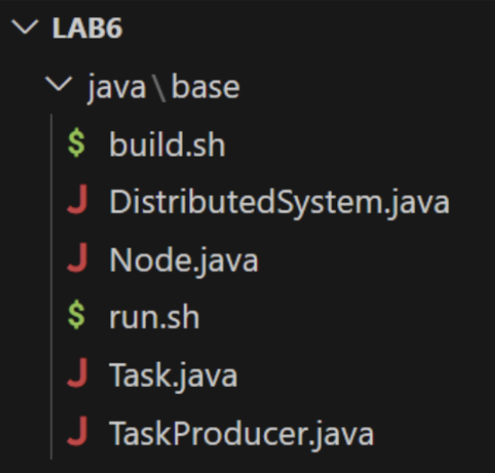

# Lab6 - Producer Consumer - 24.1

## Objetivo

O objetivo deste laboratório é resolver um problema da classe **Produtor-Consumidor** que emula um sistema distribuído para processamento de tarefas. A solução do problema deve ser
desenvolvida na linguagem de programação **Java** e utilizar
funcionalidades de alto nível e estruturas de dados concorrentes do pacote `java.util.concurrent`. O objetivo é modelar um sistema onde vários nós processam tarefas que foram produzidas por um ou mais produtor.

## Descrição

Imagine um sistema distribuído composto por um ou mais nós de
processamento e produtores de tarefas a serem processadas. O número de nós e produtores não necessariamente precisa ser o mesmo. Os produtores produzem e enviam tarefas a serem processadas por um dos nós do sistema. Cada nó pode processar uma tarefa por vez. Existe uma fila de tarefas a serem processadas que concentra as tarefasproduzidas por todos os produtores. As tarefas devem ser distribuídas dinamicamente entre os nós disponíveis, de tal forma que sempre que um nós estiver disponível, ele busca uma nova tarefa para processar da fila de tarefas. Caso a fila de tarefas esteja vazia, o nó deve ser bloqueado esperando que algum produtor adicione uma nova tarefa. O tempo que cada Task esteve ativa no sistema, (isto é, tempo em fila + tempo de execução) deve ser disponibilizado
para todos os produtores. Cada nó e produtor deve ser representado no sistema como um fluxo de execução a ser executado por uma thread no código.

Cada produtor deve produzir novas Tasks continuamente considerando um tempo específico de produção. Esse tempo de produção é específico para cada produtor e pode ser informado quando o produtor for instanciado.

Periodicamente, o sistema deve exibir, de forma agrupada por
produtor, as tarefas já executadas, o tempo que cada uma delas
esteve ativa e o tempo médio que permaneceram ativas no sistema.

Utilize as funcionalidades de alto nível e estruturas de dados concorrentes do pacote `java.util.concurrent` para desenvolver sua solução. Adiante serão descritos alguns cenários a serem
implementados para o sistema distribuído.

## Visão geral do código base

- Código base [neste repositório](https://github.com/thiagomanel/fpc/tree/master/2024.1/lab6)
O código está organizado na seguinte hierarquia:

Temos um diretório **(lab6/java/base)** que mantém um esqueleto de algumas estruturas de dados que podem ser usadas para desenvolver sua solução:
- `TaskProducer`: representa um produtor de Tasks

- `Task`: representa uma tarefa produzida por um TaskProducer. O
método execute deve ser chamado quando um nó for processar a
Task. A implementação atual emula a execução da task com um tempo variável entre 1000 e 15000 milisegundos

- `Node`: representa um nó de processamento de Task

- `ScenarioBase`: representa o sistema a ser emulado de acordo com
a descrição do cenário.
A implementação base é acompanhada de dois scripts bash: 1)
`build.sh`; 2) `run.sh`. O primeiro script compila o código
correspondente enquanto o segundo o executa. Você deve manter essa estrutura na versão concorrente do seu código.

Note que você pode evoluir o código da maneira que achar mais
adequada, adicionando/removendo atributos, métodos, classes, etc.

## Preparação

Você deve fazer download/clone do código base do repositório
1. execução do script de build;
2. execução (run.sh) da versão base;
Espera-se que a mensagem *"Scenario Base of Lab06!"* seja exibida no terminal.

- `Cenário 1`

Crie o diretório **lab6/java/scenario1**, onde você deve implementar um cenário com 5 instâncias de `TaskProducer` (cada uma produzindo uma tarefa a cada 5000 milissegundos) e 3 instâncias de `Node` para processar as tarefas produzidas. A cada 5s, o sistema deve exibir, por produtor, as tarefas já executadas, o tempo que cada uma delas esteve ativa e o tempo médio que estiveram ativas no sistema.

- `Cenário 2`

Crie o diretório **lab6/java/scenario2**. Neste cenário as Tasks devem ter uma prioridade associada, quanto menor a prioridade mais importante é a tarefa, e, por esta razão, deve ser retirada da fila de espera primeiro. Você deve fazer as adequações necessárias no código e implementar um cenário com 3 instâncias de `TaskProducer` (onde a primeira instância produz Tasks com prioridade zero a cada 13000 milissegundos, a segunda produz Tasks com prioridade um a cada 7000 milissegundos e a terceira produz Tasks com prioridade dois a cada 3000 milissegundos), e, 3 instâncias de `Node` para processar as tarefas produzidas. Novamente, a cada 5s, o sistema deve exibir, por produtor, as tarefas já executadas, o tempo que cada uma delas esteve ativa e o tempo médio que estiveram ativas no sistema.